# Introduction to R 

```
$ echo "Data Sciences Institute"
```

---

## `Getting set up`

---
### R

What is R?

- A programming language focused on statistics
- Open source and free

### Getting R

1. Go to https://cloud.r-project.org/ 
2. Click *Download R for (your operating system)*.
3. For Windows, select *install R for the first time*. For Mac and Linux, select the download that is appropriate for your OS.
4. Download and install.

---

### RStudio

What is RStudio?

- The integrated development environment (IDE) that lets us run R code
- Desktop and cloud versions available

### Getting RStudio

1. Go to rstudio.com
2. Under *Products*, look under *Open Source* and select *RStudio.
3. Scroll down and select *RStudio Desktop* and *DOWNLOAD RSTUDIO DESKTOP*.
4. Select the *DOWNLOAD* button under the *Free* version of RStudio Desktop.
5. If the download that is "Recommended for your system" is correct, click the download button. If not, scroll down and find the version that is correct for your OS.
6. Download and install.
7. Open and test to ensure RStudio is working.

---

## Any questions with R or RStudio setup?

---

### If you have downloaded R and RStudio:
* Read about RStudio: http://swcarpentry.github.io/r-novice-inflammation/09-supp-intro-rstudio/index.html

* Watch the video about data science tools. Pay attention to R: https://www.youtube.com/watch?v=pKPaHH7hnv8&t=99s

---

## RStudio

---

### Welcome to RStudio

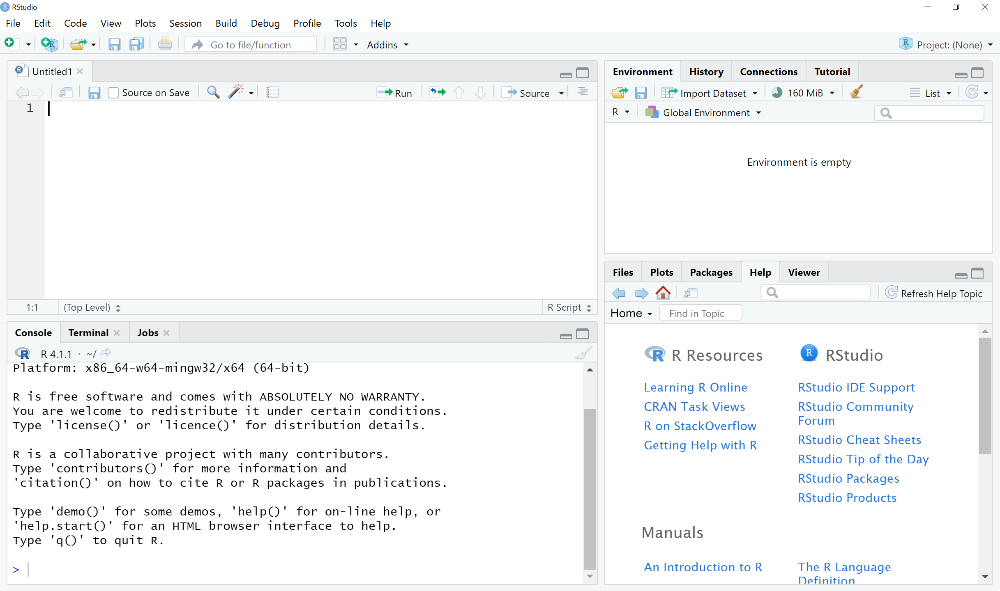

---

Your saved R files, where you can write and edit code, are in the upper left. If you do not have a file open, this section will be collapsed.


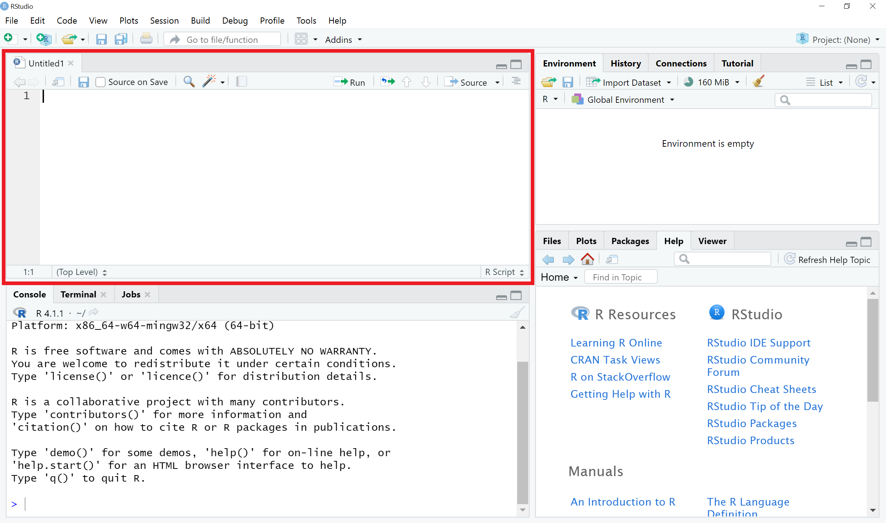

---

The console, where you run code and view output, is on the lower left.

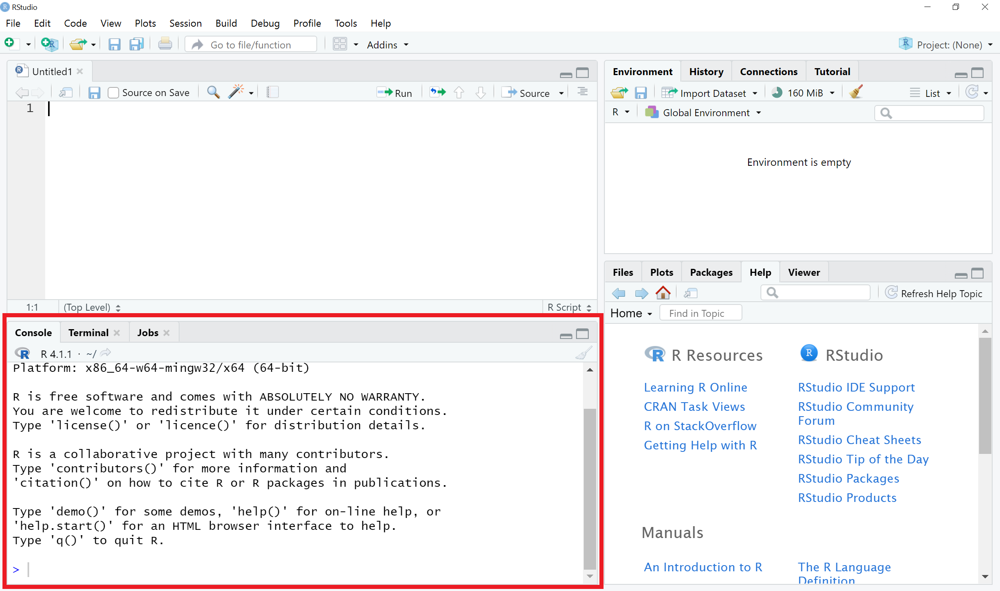

---

The environment, where you can see variables that you have saved, is on the upper right.

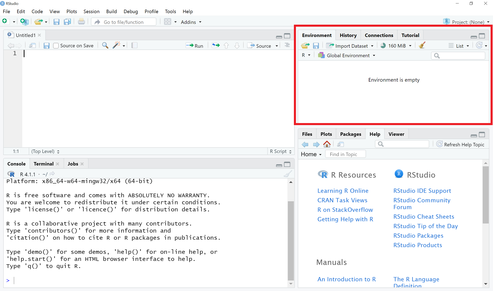

---

The lower right section contains:

- *Files*, where you see the folder structure of your working directory
- *Plots*, where plots you create are displayed
- *Packages*, an inventory of all R packages that are installed
- *Help*, where you can search information about R functions and packages


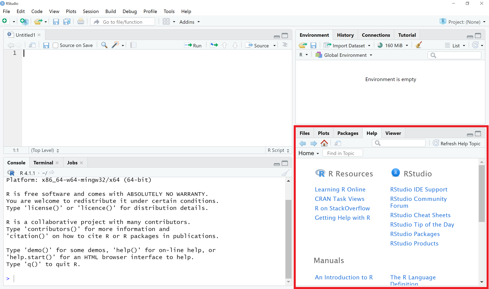


---

### Interacting with R

* Console:
    * Type commands directly into the console and press ‘Enter’ to execute.
    
* Script:
    * Put cursor at the end of the line to execute OR highlight the section.
    * Press ‘Ctrl’ + ‘Enter’ on Windows, Mac OR ‘Cmd’ + ‘Return’ on Mac.
    
* Clear console with ‘Ctrl’ + ‘L’.

* If R is still waiting for you to enter more text, the console will show a + prompt.

---

### R Project

* Good to keep data, analyses, and text in a single folder. 

* RStudio interface for this is Projects.
    * File → New project; choose New directory → New project

* Enter a name for this new folder (“directory”) and choose a convenient location for it. This will be your working directory.
    * On Desktop, save as ‘DSI IntroR’

* Click on ‘Create’ project.

* Create a new file where we will type our scripts.
    * Go to File → New File → R script. Click the save icon on your toolbar and save your script as “script.R”.

---

## R basics

---

### Location

* Current location:
```r
getwd() # current location of the file, if saved
``` 

* Set working directory: By typing the path
```r
setwd("/Users/<Name>/Desktop")
``` 

* Or (recommended method):
    * Session → Set Working Directory → Choose Directory...

---
### R Coding Style

* Limit yourself to 80 characters per line.

* Use comments. Don’t describe what the code does, but explain why you wrote it that way.

* Use only `<-` for assignment, not `=`.

* Never reassign reserved words.

* You may read more:
    * https://google.github.io/styleguide/Rguide.html
    * http://steipe.biochemistry.utoronto.ca/abc/index.php/RPR-Coding_style

---
### R Features
* In R, the indexing begins from 1.

* R is case sensitive (“`X`” is not the same as “`x`”).

* R uses dynamic variable typing, so variables can be used over and over again.

---
### Mathematical operators

For now we will work in the console.

To run code, hit enter.

If it runs successfully, you will see a `>` on the line with the cursor.

If it instead shows a `+`, the command was incomplete. You can finish the command and hit enter, or hit ESCAPE to start again.

```r
(27 + 0.4 - 2 * 7 / 11) ^ 3
``` 

---

### Creating objects

`<-` is the assignment operator.

To assign the value 27 to the object named `num_participants`, you type:

```r
num_participants <- 27
```

Remember that names:

- must start with a letter
- can only contain letters, numbers, underscores, and periods

Running the name of the object will display the object.

```r
num_participants
```

---

### Functions

Built-in functions perform many operations. They take the form:
`function_name(argument1 = value1, argument2 = value2, ...)`

```r
sqrt(16)
seq(1, 14)
```

---
### R Help

* Online documentation for functions and variables in R exists.

* Obtained by typing `help(FunctionName)` or `?FunctionName` at the R prompt, where `FunctionName` is the name of the function.

```r
help(sqrt)

?sqrt
``` 

---

### R Packages

* Packages are collections of R functions, data, and compiled code.

* Libraries are directories in R where the packages are stored.

* Built-in functions are part of R standard or base packages and do not need to be downloaded.

```r
library(help = "base")
library(help = "stats")
```

* Some functions are not built-in. To get these, need to download packages

* R packages extend R's functionality.

---
### R Packages

* Popular repositories for Packages:
    * The Comprehensive R Archive Network (CRAN)
      * Link: https://cran.r-project.org/web/packages/ 
    
    * Bioconductor
      * Link: https://www.bioconductor.org/packages/release/bioc/ 
    
    * GitHub
      * Link: https://github.com/search?q=r+packages&type=registrypackages
    
    
* Depending on the source of Package, downloading instructions may differ.

---

### R Packages

* R packages extend R's functionality.

* tidyverse is a package from CRAN. 

* Link: https://cran.r-project.org/web/packages/tidyverse/index.html
    * What is the current version?
    * Who is the author?
    * How to report an issue?
    * How can a user access Reference Manual?

* To download tidyverse:

```r
install.packages("tidyverse")
```
---

### R Packages

* Every time you download a package or start a new RStudio session, you will need to load the packages you want to use.

```r
library(tidyverse)
```

---

### tidyverse

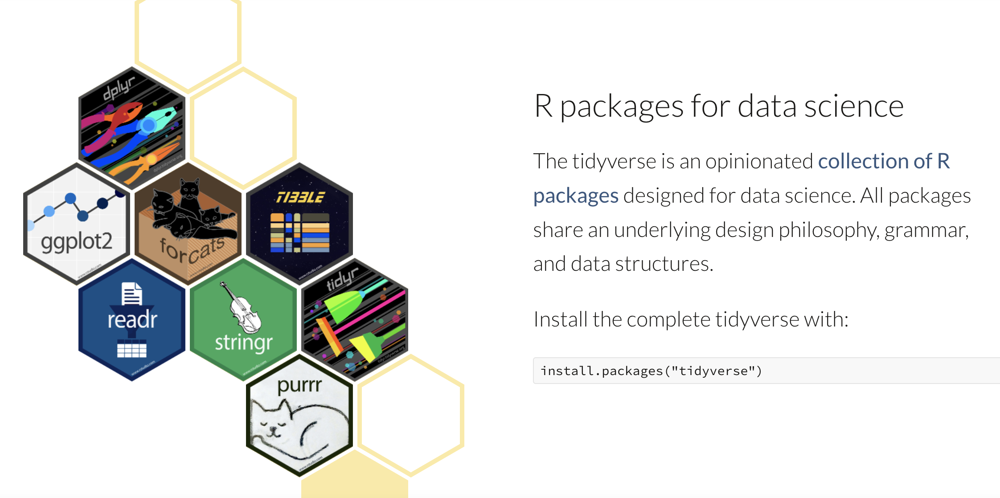

* More details on ‘tidyverse’ package (only after downloading):

```r
ls("package:tidyverse") # list all functions in package
?tidyverse # get information on package
```

---

## Exercises

---

### Basic Operations

1. Install and load the `faraway` library.
2. Create an object named `my_sequence` that is a sequence from 1 to 7.
3. Use an R function to take the square roots of all the numbers in the sequence. Save this new sequence as an object named `sqrt_sequence`.
4. Multiply `sqrt_sequence` by 3.

---

## File types

---

### R Scripts

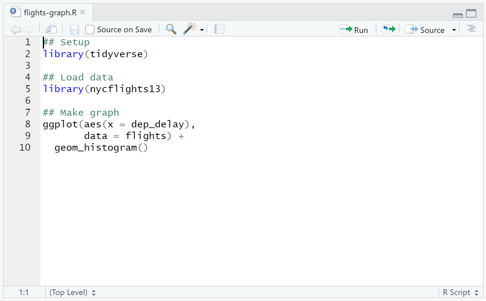

---

### R Scripts

R Scripts are files where you can save and edit your code. 

### Running code

Run the entire script by pressing Run


Run the command where your cursor is located by pressing Cmd/Ctrl + Enter

Run a section of commands by highlighting them and pressing Cmd/Ctrl + Enter

---

### Diagnostics

When working in a script, RStudio will mark syntax errors. If you hover over the red x, you can see what the problem is.

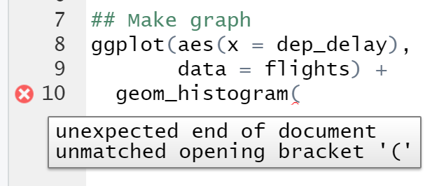

---

### R Markdown

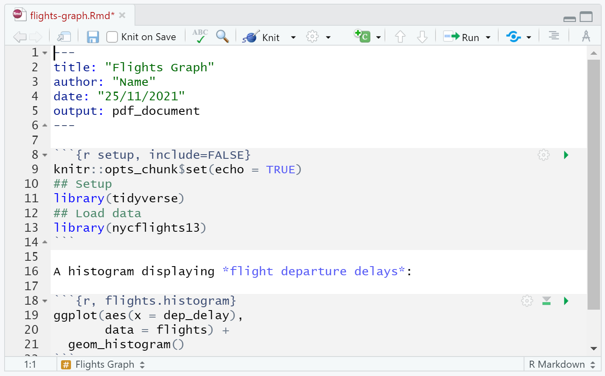

---

### R Markdown

R Markdown files combine code chunks with the results of those chunks and text.
They support output formats like PDFs, html, Word files, and slideshows.

---

### Components

In the YAML header, the document information and settings are specified.

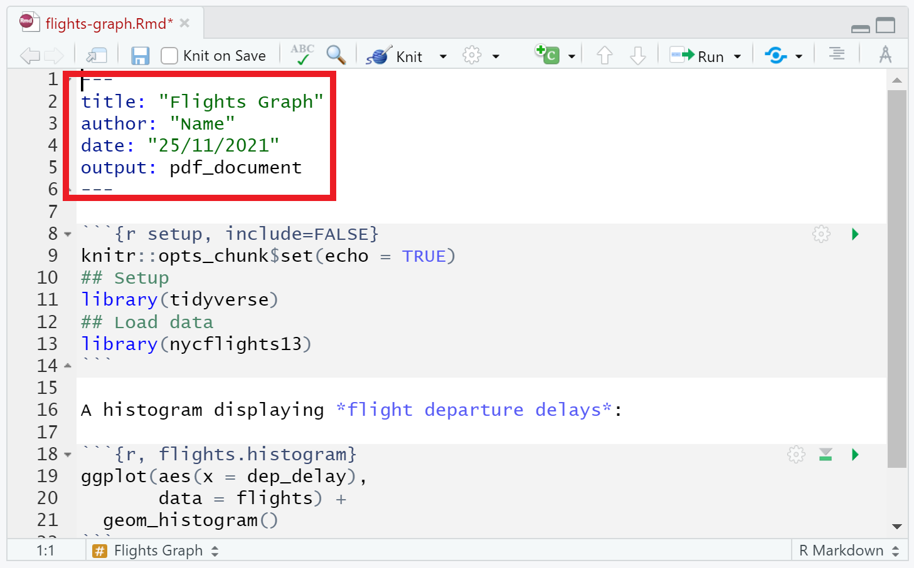

---

### Components

Text goes in between the code chunks. This text can be formatted with basic markdown syntax.

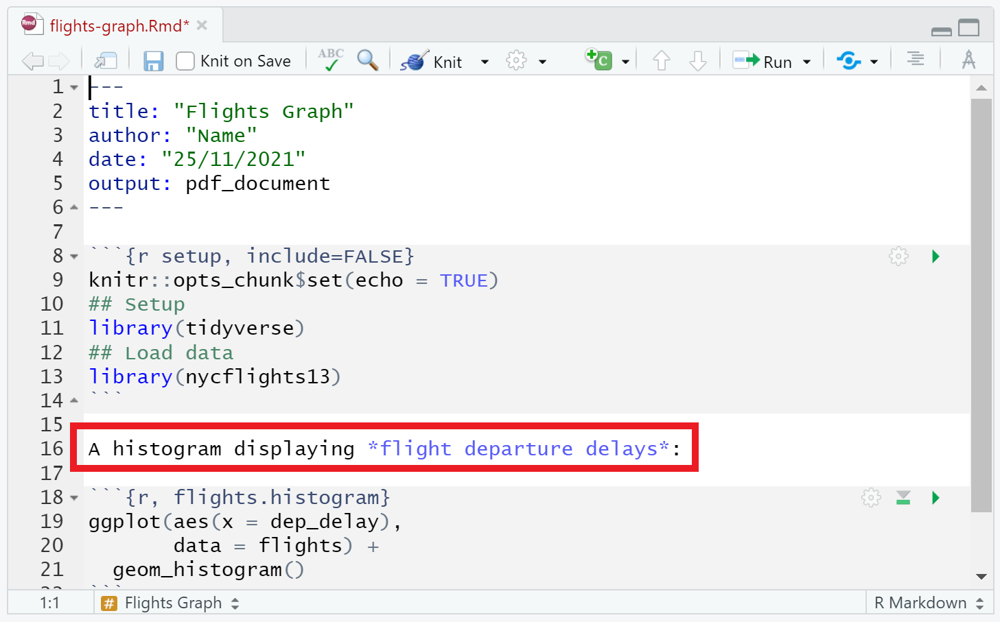

---

### Components

You can write in code chunks the same way you would write in a script.

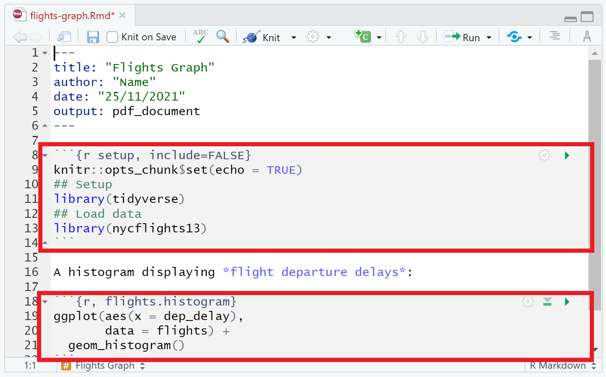

---

### Running code

Like with a script, you can use the Run button Cmd/Ctrl + Enter.

Each chunk also has an arrow you can press to run the code in that chunk.

The output will display below the code chunk rather than in the console or the Plots section.

---

### Knitting .Rmd files

To present your work, you can knit your R Markdown file to a more common file type, including PDFs, Word documents, and html files.

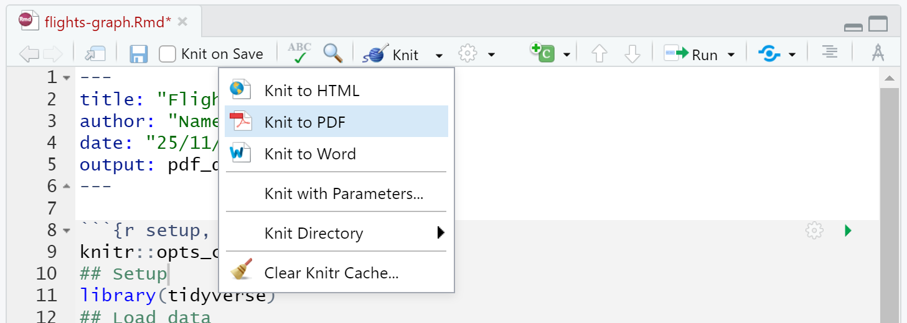

---

## Exercises

---

### R scripts

1. Create a new R script.
2. Save the script.
3. Write code to calculate the average of ten numbers.
4. Run the script.

---

### R Markdown

1. Create a new R Markdown file.
2. Save the file.
3. Load the `tidyverse` and `faraway` libraries.
4. Load the dataset `broccoli` by calling the function `data()`
5. Print out the `broccoli` dataset in the R Markdown file.
6. Knit the R Markdown file to PDF.

---

# Any questions?
