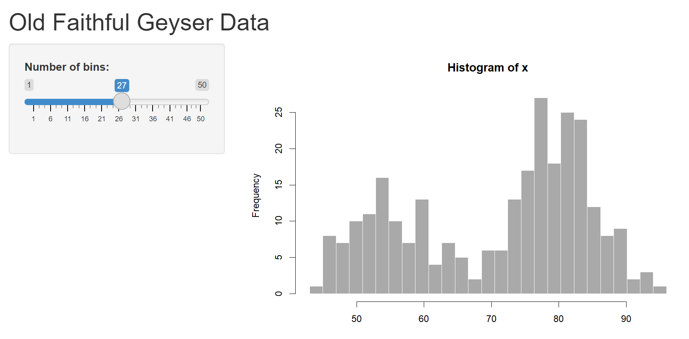

# Shiny apps

```
$ echo "Data Sciences Institute"
```

---
### What you need

Packages:

-   `library(shiny)`
-   `library(ggplot2)`

---

### Creating an App Directory and File

-   File \> New File \> Shiny Web App \> Single File \> Create
-   Hit Run App. What happens?



Note where it says "Listening on http://127.0.0.1:<port number>. This is the URL where your app can be found, which is local at this point.

---

### App Layout

```r
library(shiny)

ui <- fluidPage(
    <Define UI for application to draw graphs etc>
)

server <- function(input, output) {
    <Define the server logic necessary for the graphs above>
}

# Run the application 
shinyApp(ui = ui, server = server)
```
---

### A Basic App

```r
ui <- fluidPage(
  "Hello, world!"
  )

server <- function(input, output, session) {
}

shinyApp(ui, server)
```
---

### Adding UI Controls

```r
ui <- fluidPage(
  selectInput("dataset",
              label = "Dataset",
              choices = ls("package:datasets")),
  verbatimTextOutput("summary"),
  tableOutput("table")
)
```

-   `fluidPage` specifies the basic visual layout of the page
-   `selectInput` is what makes it so the user can interact with the app by providing a value, for example in a dropdown menu.
-   `verbatimTextOutput` and `tableOutput` specify where to put the outputs

---
<style scoped>section{font-size:22px;}</style>

### Adding Behavior

Shiny apps use reactive programming, which tells the app how to perform an action but does not instruct it to perform the action.

```r
server <- function(input, output, session) {
  
  output$summary <- renderPrint({
    dataset <- get(input$dataset,
                   "package:datasets")
    summary(dataset)
  })
  
  output$table <- renderTable({
    dataset <- get(input$dataset,
                   "package:datasets")
      dataset
    })
  }
```

This tells the app how to construct the table and summary outputs.

Note that `verbatimTextOutput("summary")` above matches `output\$summary`, and `tableOutput("table")` above matches `output\$table`.

Each type of output has a different render function.

---

### Reducing Duplication with Reactive Expressions

```r
server <- function(input, output, session) {
  dataset <- reactive({ # reactive expression is created
    get(input$dataset, "package:datasets")
  })
  
  output$summary <- renderPrint({
    summary(dataset()) #reactive expression is called
  })
  
  output$table <- renderTable({
    dataset()
  })
}
```
---

<style scoped>section{font-size:20px;}</style>

### Exercises

Experiment with the code below until you have an app that produces a table and histogram(s) for each of the datasets on the dropdown.

```r
library(shiny)
library(ggplot2)

datasets <- c("economics", "seals")

ui <- fluidPage(
  selectInput("dataset", "Dataset", choices = datasets),
  verbatimTextOutput("summary"),
  tableOutput("plot")
)

server <- function(input, output, session) {
  dataset <- reactive({
    get(input$dataset, "package:ggplot2")
  })
  output$summary <- renderPrint({
    summary(dataset())
  })
  output$plot <- renderPlot({
    plot(dataset)
  }, res = 96)
}

shinyApp(ui, server)
```
---

### Questions?