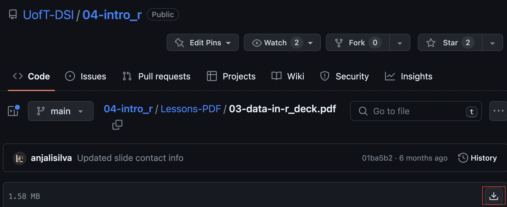

# Introduction To R

Welcome! This course, offered by the University of Toronto's Data Sciences Institute Professional Programming, focuses on the use of tools and skills needed to handle the extensive data generated by advancing information technology. One prominent tool is R, a freely available open-source language and environment specifically designed for data science. The course provides comprehensive coverage of R and data science topics, demonstrating their practical applications using RStudio.

## Contents
1. [Description](#Description)
2. [Learning Outcomes](#Learning-Outcomes)
3. [Course Contact](#Course-Contact)
4. [Delivery Instructions](#Delivery-Instructions)
5. [Course Notes](#Course-Notes)
6. [Materials](#Materials)
7. [Schedule](#Schedule)
8. [Marking Scheme](#Marking-Scheme)
9. [Course Policies](#Course-Policies)

## Course Overview

## Description
This course is designed as an immersive learning experience. The estimated time commitment consists of approximately 7 hours of in-class instruction, 3 hours of optional but highly recommended tutorials, and 5 hours dedicated to self-study and completing homework assignments. In total, learners can expect to dedicate approximately 15 hours per week over a span of 3 weeks to successfully complete the course.

The first part of this course teaches R with a focus on manipulating and visualizing data. Learners will get set up with a functional RStudio workflow, use different file types, transform data tables, import and manipulate data, use functions and loops, create data visualizations, make a Shiny app, and learn how to solve problems with their programming. Both base R and tidyverse methods are taught. To work reproducibly, learners will create R Projects. The second part of the course will cover the ethics of consent, Equity, Diversity & Inclusion (EDI) training, and professional skills including presentation, project management, and data security. Finally, the course will conclude with an industry case study. 

This course is designed for those who have a degree in something other than Computer Science/Statistics who are looking to enhance their data science skills for their career.

## Learning Outcomes
By the end of this course, learners will be able to:

1. Gain proficiency in utilizing R by understanding various options available for working with R, comprehending the purpose of RStudio and R Projects, adhering to best coding practices in R, and recognizing the position of R among other data science tools.

2. Apply manipulation and wrangling techniques to describe and define the characteristics of datasets. Learners will become proficient in accessing built-in R datasets and importing external datasets into R, identifying and describing data structures, reshaping datasets through manipulation techniques, detecting missing values, cleaning data, summarizing data, exporting data, and reporting findings. Learners will also be able to produce a wide range of informative and visually appealing charts, graphs, and plots to effectively communicate insights and patterns hidden within the data.

3. Develop the skills and strategies necessary to diagnose and fix errors in R. Learners will gain proficiency in interpreting error messages, identifying common coding mistakes, and utilizing debugging tools and techniques effectively. Learners will be able to apply systematic approaches to troubleshoot and resolve errors in their R code.

4. Demonstrate a comprehensive understanding of the concept of consent in data-based studies. Learners will be able to identify the ethical considerations and legal requirements related to obtaining informed consent from participants, and apply appropriate strategies to ensure ethical data  usage.

5. Acquire the skills and knowledge required to create compelling presentations and effectively manage projects using R. Learners will demonstrate proficiency in utilizing R's visualization and presentation packages to generate visually appealing and informative slides, charts, and graphs. They will also gain proficiency in project management techniques specific to R, including organizing and structuring R code, as well as effectively documenting code.

# Logistical Information

## Course Contact
-  Instructor for this course is Julia Gallucci, PhD student (she/her). For emails to the instructor, use julia.gallucci@mail.utoronto.ca. Must use the subject line DSI-IntroR. E.g., DSI-IntroR: Inquiry about Lecture I. 
-  Response times: 48 hrs on week days, 48-72 hrs on weekends.

## Delivery Instructions
### Classes
- The course will span three weeks, with classes scheduled for three days each week. Classes are 6 PM - 8 PM EST on Mondays and Thursdays, and 9 AM - 12 PM EST on Saturdays. The format of the course will be online and synchronous, conducted through Zoom (Meeting ID and passcode provided in the email subject 'Data Sciences Institute, UofT – Welcome & Pre-Class info'). Being mindful of online fatigue, there will be one or two brief breaks during each class. In the event that you encounter any difficulties joining the live lectures, it is essential to email the Instructor. Provide a description of the issue, along with the time and date of occurrence (including a screenshot if available), to ensure that participation marks are not affected. If, due to unforeseen circumstances, the live (synchronous) lecture is disrupted or cannot be conducted, the instructor will upload a recording and notify the students via email. It is the responsibility of the learners to view the recording.

### Tutorials
- Tutorial sessions will be conducted on the same dates as the regular classes. These tutorials are scheduled for Mondays and Thursdays, from 5 PM to 6 PM EST, as well as Saturdays from 8:30 AM to 9 AM EST and 12 PM to 12:30 PM EST. Attendance at the tutorials is optional, and the structure is flexible. Tutorials provide an opportunity to seek clarification on software-related inquiries, homework, and assignments. The course instructor will also be leading the tutorial sessions.

## Course Notes
-   All course material will be available via [IntroductionToR](https://github.com/UofT-DSI/04-intro_r) GitHub repository. 
Folder structure is as follows:

     * **Assessments**:  
     This folder contains assessment files for learners.
     * Lessons-AllFiles:  
     This folder contains all files (Rmarkdown, slide-html, slide-PDFs, images, data, etc.) and is designed for the instructor. 
     * **Lessons-Data**:  
     This folder contains data only and is designed for the learners. Learners should download and copy this folder as 'data' folder within their R Project.
     * **Lessons-PDF**:  
     This folder contains slide-PDFs only and is designed for the learners. Learners should download the slides. Slides should be referenced before class to prepare or after class to review. During class, there will be mostly live-coding. The end of each slide deck will contain homework for that particular lesson. It is highly recommend that learners attempt these and attend tutorial sessions to seek help.
     * Lessons-Rscripts:  
     This folder contains R scripts used by the instructor. It will be udpated after each class and learners may download it for reference. 
     * Teaching-Notes:  
     This folder contains lesson plans only and is designed to guide the instructor.
     * README: README file.
     * .gitignore: List of files to ignore specified by instructor.
     
## Materials
* **Learners must have internet connection, and a computer with administrative privileges, a microphone, and all required software installed in order to participate in online activities.** 
* **Learners must have R (http://www.r-project.org/). We will help with downloading.**
* **Learners must have RStudio (Previously: http://www.rstudio.com/; now: https://posit.co/download/rstudio-desktop/). We will help with downloading.**
* **GitHub account (https://github.com/).**
* Screen space can be a limitation during online learning since you'll want to see the instructor's screen and have your RStudio open so that you can type along. If you have access to a second monitor or a larger tablet to attend the course while keeping your laptop screen available for coding - this would be great! If not - don't worry, we'll manage!
* Key texts: General reference
    *  Wickham and Grolemund, 2017, *R for Data Science*, O'Reilly. https://r4ds.had.co.nz/ 
    *  Alexander (eds), 2021, *DoSS Toolkit*, https://rohanalexander.github.io/doss_toolkit_book/  
* Key texts: For specific topics
    * Alexander, 2022, *Telling Stories with Data*, CRC Press. https://www.tellingstorieswithdata.com/ 
    * de Graaf, 2019. *Managing Your Data Science Projects: Learn Salesmanship, Presentation, and Maintenance of Completed Models*, Apress.
    * Healy, 2018. *Data Visualization*: A Practical Introduction, Princeton University Press
    * Timbers et al., 2021. *Data Science: A First Introduction*. https://ubc-dsci.github.io/introduction-to-datascience/ 
    * Wickham, 2021. *Mastering Shiny*, O'Reilly. https://mastering-shiny.org/ 
    * Wiley, Matt, Wiley, Joshua F., 2020. *Advanced R 4 Data Programming and the Cloud*
    * *Using PostgreSQL, AWS, and Shiny*, Apress.

## Schedule
Schedule may be modified as needed, and learners will be informed. Course will be taught using R version 4.2.1 and RStudio Desktop version 2022.06.23. 

### Class topics
| Class | Date | Topic | Slides |
| --- | --- | --- | --- |
| 0 | Before Class 1 | Getting set up!   (R/RStudio Installation) | [Instructions](./Lessons-PDF/GetSetUp_R_RStudio.pdf)|
| 1 | Monday 29 May   6 PM - 8 PM EST | Hello World! And Work practices   (R basics; file types; errors) | [0- Introduction](./Lessons-PDF/00-introduction_deck.pdf)   [1- Hello World](./Lessons-PDF/01-hello-world_deck.pdf)   [2- Work Practices](./Lessons-PDF/02-work-practices_deck.pdf)|
| 2 | Thursday 1 June   6 PM - 8 PM EST | Data in R   (tibbles, strings, factors, times, missing values) | [3- Data in R](./Lessons-PDF/00-data-in-r_deck.pdf)|
| 3 | Saturday 3 June   9 AM - 12 PM EST | Manipulation   (filtering, arranging, selecting, mutating, piping, grouping, summarizing) |  |
| 4 | Monday 5 June   6 PM - 8 PM EST | Wrangling   (importing data, pivot, joining data, data tables) |  |
| 5 | Thursday 8 June   6 PM - 8 PM EST | Programming   (custom functions, loops, logic statements, purr, simulations) |  |
| 6 | Saturday 10 June   9 AM - 12 PM EST | Visualization   (initialization, choosing chart types, ggplot, customizing) |  |
| 7 | Monday 12 June   6 PM - 8 PM EST | Shiny applications; Ethics, inequity and professional skills |  |
| 8 | Thursday 15 June   6 PM - 8 PM EST | Industry case study- Kamilah Ebrahim |  |
| 9 | Saturday 17 June   9 AM - 12 PM EST | R Review and practice |  |                                                                                                                                                                                                                                        	|

## Marking Scheme
Grading is based on two components: 2 assignments, and class participation. The grading scheme is as follows:
| Assessment | Number | Individual Weight | Cumulative Weight |
| --- | --- | --- | --- |
| Assignments | 2 | 45% | 90% |
| Participation | NA | NA | 10% |

**Assignments**
Assignments will be introduced in class, can be discussed in tutorial, and questions can be ask of the Instructor over email. Assignments are due by midnight on Sundays. Please arrange for extensions in advance with the Instructor. Please email submissions, as an RMarkdown PDF, to the Instructor titled DSI-IntroR: Assignment X, Name. The assignments are located in the Assessment directory, located above. You will find an .pdf file (knitted Markdown file) for convenient reading purposes, as well as an .Rmd file that can be modified and submitted. To download the files, click on "Raw" and select "Save as."

### Assignment Due-dates

| Assessment	|  Due Date | 
| --- | --- | 
| Assignment 1|	 Sunday 11 June, by 11:59 PM EST| 
| Assignment 2|	 Sunday 18 June, by 11:59 PM EST| 

# Course Policies

## During Class
-   The course will include mainly live-coding classes. Learners are expected to follow along with the coding. Be mindful of online fatigue. Be respectful and only one speaker at a time. Use name provided in the course when participating in Zoom. You may use chat or microphone to ask questions. Keep microphones muted, unless you need to speak. Use raise hand feature, and indicate your name before speaking. Keeping your video on is optional, however, if you choose to leave it on, be mindful of what your peers can see. Course communications will take place via email. Learners with diverse learning styles and needs are welcome in this course. 

## Assignment Submission Policy
-   See above for assessment weights, deadlines and guidelines. All assessment submissions must be done via email, unless stated otherwise. When submitting assessment files, label using this format: LASTNAME_FirstInitial_Assessment.format. E.g., GALLUCCI_J_A1.PDF. Instructions of each assessment will specify the ‘Assessment’ name and format. Students must follow this label format. The student is responsible for emailing correct files on time, in the format specified.

## Late Penalty Policy
-   10% of the mark will be deducted for each day late, up to 30%. Assignments will NOT be accepted after three days. Be sure to plan well in advance.

## Academic Integrity and Honesty
-   In this course you are expected to follow full disclosure policy: If it’s not your own, new idea, it has a source. All sources must be referenced. For advice on how not to plagiarize, read: https://advice.writing.utoronto.ca/using-sources/, https://www.academicintegrity.utoronto.ca/, and https://guides.library.utoronto.ca/plagiarism. You are responsible for understanding University policies on academic integrity. 

## Keep Copies of Everything
-   Each student should keep all copies of any assessments submitted.

## Collaboration
-   While you are encouraged to discuss approaches to assessments with other students, the material turned in must be your own.

## Notice of Video Recording and Sharing (Download Prohibited; Reuse Prohibited)
- Video recordings of this course, including your participation, may be created and made accessible to students for remote viewing during and after each session. These course videos and materials are the property of your instructor, the University, and/or other relevant sources, and they are protected by copyright. As a student in this course, you are allowed to view the session videos and materials for your own academic purposes. However, it is important to note that copying, sharing, or using them for any other purpose without explicit permission from the instructor is prohibited. If you have any inquiries regarding the recording and usage of videos in which you appear, please reach out to the instructo

 

## Missed Class
-   Students who are absent from class for any reason (e.g., COVID, other illness or injury, family situation) and who require consideration for missed academic work should report their absence to instructor and TA, and discuss any needed consideration.

## Downloading Files
-   All course material will be available via [IntroductionToR](https://github.com/anjalisilva/IntroductionToR) GitHub repository. As per prerequisites outlined for the course, it will be assumed that learners are familiar with GitHub. If you are unsure how to download files from GitHub, you may visit the repository [link](https://github.com/anjalisilva/IntroductionToR) and click 'Code' and then 'Download zip' to download all files, as shown below (see red arrows 1 and 2):

  
  
-   Alternatively, to download individual files, e.g., 03-Data-in-R PDF slides only, visit the slide [link](https://github.com/anjalisilva/IntroductionToR/blob/main/Lessons-PDF/03-data-in-r_deck.pdf) and click the 'Download' button on top right side of page as shown below (see red arrow):

  
  
  
-   You may also read about [cloning a GitHub repository](https://docs.github.com/en/repositories/creating-and-managing-repositories/cloning-a-repository).

 

# Acknowledgements
- Slides are adapted from Anjali Silva, originally from Amy Farrow under the supervision of Rohan Alexander, University of Toronto. Slides have been created and modified by Julia Gallucci for Summer 2023.

- We wish to acknowledge this land on which the University of Toronto operates. For thousands of years it has been the traditional land of the Huron-Wendat, the Seneca, and most recently, the Mississaugas of the Credit River. Today, this meeting place is still the home to many Indigenous people from across Turtle Island and we are grateful to have the opportunity to work on this land.

## Maintainer
-   Julia Gallucci (<julia.gallucci@mail.utoronto.ca>), University of Toronto.

## Contributions
-   `IntroductionToR` welcomes issues, enhancement requests, and other contributions. To submit an issue, use the [GitHub
issues](https://github.com/anjalisilva/IntroductionToR/issues).
